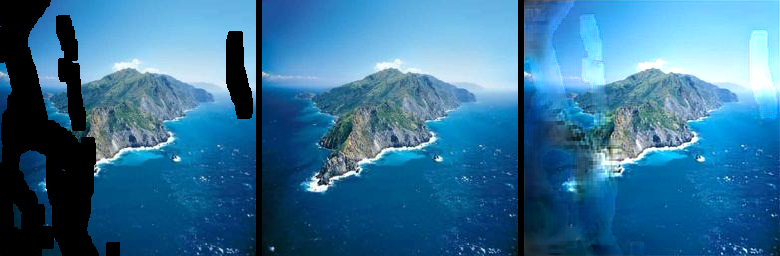
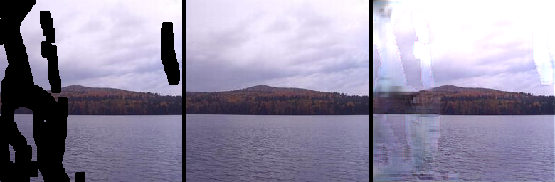

# Project
### Image Inpainting (2019.05)
[GitHub](https://github.com/NaturezzZ/Inpainting){: .btn }
- This is a open source project based on Guilin Liu et al., M.: Image Inpainting for Irregular Holes Using Partial Convolutions. arXiv preprint arXiv: 1804.07723v2(2018).
- As the project of introduction to AI, a PKU course, it is a simplified version of the NVIDIA work because of our lack of computing resource but it still makes good performance in most situations.
- There is also a user interface(Simplified Chinese) based on C++ in the folder show and you should put the .pkl file in the corresponding folder.

