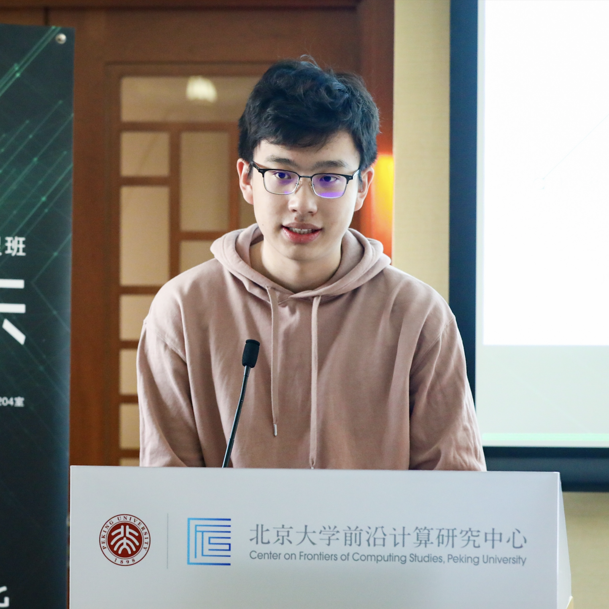

<td></td>

<td>

<h1>Naiqian Zheng <I>(郑乃千)</I></h1>
School of EECS, Peking University
<I>(北京大学信息科学技术学院)</I> 
 
<a href = "mailto://zhengnaiqian@pku.edu.cn" > zhengnaiqian@pku.edu.cn</a>  
<a href = "https://github.com/naturezzz"> GitHub</a> / <a href = "https://www.linkedin.com/in/naiqian-zheng-05b36b1a5/"> LinkedIn</a>
 

</td>

## About me
I am an undergraduate in school of Electronics Engineering and Computer Science in Peking University (2018-) and a former participant of Physics Olympiad (2015-2018). 

I am advised by [Prof. Xin Jin](https://www.cs.jhu.edu/~xinjin/) and [Prof. Tong Yang](http://net.pku.edu.cn/~yangtong/). My research interests are System Building, Data Center Networking and Dataplane Programmability.

## Publications
- LightGuardian: A Full-Visibility, Lightweight, In-band Telemetry System Using Sketchlets
  - **[NSDI'21 (to appear)]** Yikai Zhao, Kaicheng Yang, Zirui Liu, Tong Yang, Li Chen, Shiyi Liu, **Naiqian Zheng**, Ruixin Wang, Hanbo Wu, Yi Wang, Nicholas Zhang.

## Teaching
- [2020 Fall] <b>TA</b>, Introduction to Computer System (a PKU course based on CMU 15213).

## Internship
- [09/2020 - 01/2021] **ByteDance Inc.**, computer networking research and development.

## Services
- Invited talk on Research Sharing Conference of Turing Class, PKU
  - Hot Topics in Networks, a Data Center Networking System's Perspective

## Activaties
- [01/2021] Start research on system advised by [Prof. Xin Jin](https://www.cs.jhu.edu/~xinjin/).
- [12/2020] LightGuardian is accepted by NSDI'21.
- [11/2020] Give a long talk (Hot Topics in Networks, a Data Center Networking's Perspective) on Research Sharing Conference of Turing Class and serve as committee member.
- [09/2020] Start Research Intern at [ByteDance Inc.](https://bytedance.com/en/) on networking.
- [02/2020] Start research on network advised by [Prof. Tong Yang](http://net.pku.edu.cn/~yangtong/).
- [06/2019] Enter Turing Class 2018.
- [09/2018] Enter Peking University to study computer science.
